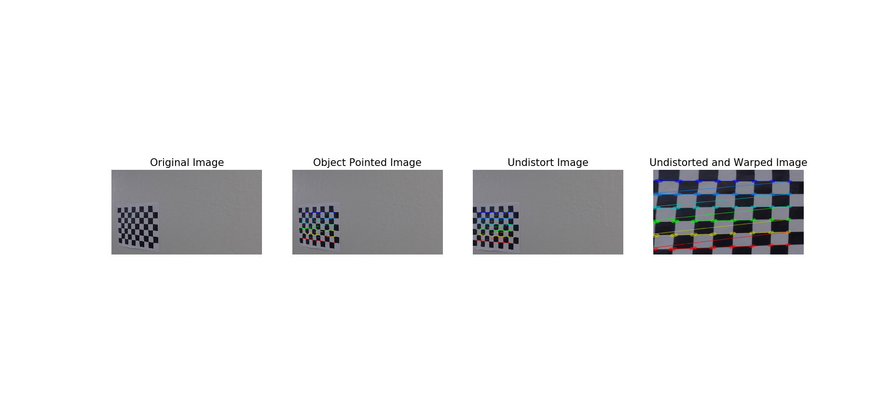
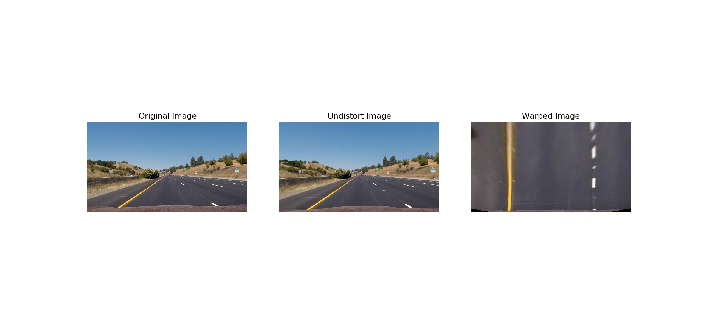
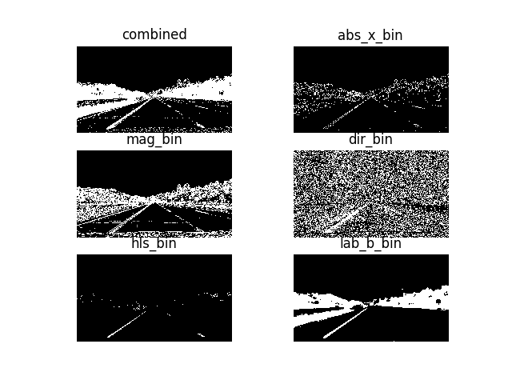
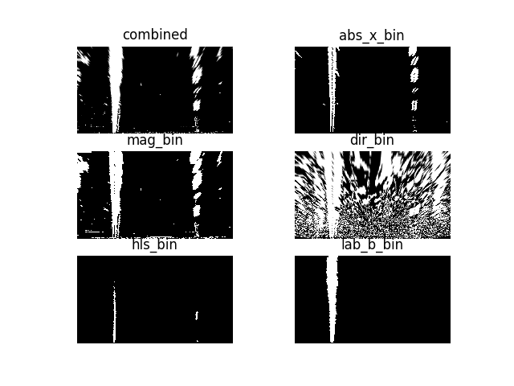
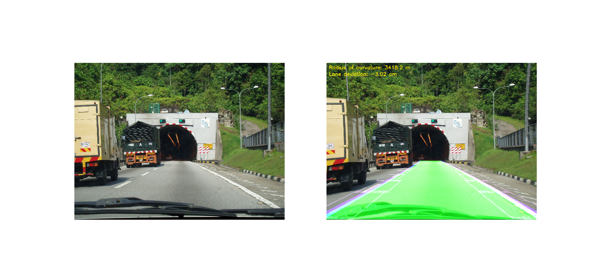

**Advanced Lane Finding Project**
---
The goals / steps of this project are the following:

* Compute the camera calibration matrix and distortion coefficients given a set of chessboard images.
* Apply a distortion correction to raw images.
* Use color transforms, gradients, etc., to create a thresholded binary image.
* Apply a perspective transform to rectify binary image ("birds-eye view").
* Detect lane pixels and fit to find the lane boundary.
* Determine the curvature of the lane and vehicle position with respect to center.
* Warp the detected lane boundaries back onto the original image.
* Output visual display of the lane boundaries and numerical estimation of lane curvature and vehicle position.

Dependencies
---
- Python 3.5
- OpenCV-Python
- Matplotlib
- Pickle
- Numpy


[image1]: ./examples/undistort_output.png "Undistorted"
[image2]: ./test_images/test1.jpg "Road Transformed"
[image3]: ./examples/binary_combo_example.jpg "Binary Example"
[image4]: ./examples/warped_straight_lines.jpg "Warp Example"
[image5]: ./examples/color_fit_lines.jpg "Fit Visual"
[image6]: ./examples/example_output.jpg "Output"
[video1]: ./project_video.mp4 "Video"


### Camera Calibration
---
The code for this step is contained in the `calibrate_camera.py`. To visualize in chessboard use this `visualize_calibratechessboard.py`.

I start by preparing "object points", which will be the (x, y, z) coordinates of the chessboard corners in the world. Here I am assuming the chessboard is fixed on the (x, y) plane at z=0, such that the object points are the same for each calibration image.  Thus, `objp` is just a replicated array of coordinates, and `objpoints` will be appended with a copy of it every time I successfully detect all chessboard corners in a test image.  `imgpoints` will be appended with the (x, y) pixel position of each of the corners in the image plane with each successful chessboard detection.  

I then used the output `objpoints` and `imgpoints` to compute the camera calibration and distortion coefficients using the `cv2.calibrateCamera()` function.  I applied this distortion correction to the test image using the `cv2.undistort()` function and obtained this result: 



### Pipeline (single images)

#### 1. Provide an example of a distortion-corrected image.
To demonstrate this step, I will describe how I apply the distortion correction to one of the test images like this one:

#### 2. Describe how (and identify where in your code) you used color transforms, gradients or other methods to create a thresholded binary image.  Provide an example of a binary image result.
I used a combination of color and gradient thresholds to generate a binary image (thresholding steps at lines #1 through #96 in `image_processing.py`).  Here's an example of my output for this step.  (note: this is not actually from one of the test images)

##### Combination Threshold
- abs_x_bin - abs_sobel_threshold() at lines #8 through #17 in `image_processing.py`
- mag_bin - magnitude_threshold() at lines #19 through #30 in `image_processing.py`
- dir_bin - direction_threshold() at lines #33 through #46 in `image_processing.py`
- hls - hls_threshold() at lines #49 through #54 in `image_processing.py`
- lab_b_bin - lab_b_threshold() at lines #56 through #61 in `image_processing.py`
- Combined - combined_threshold() at lines #63 through #75 in `image_processing.py`

##### Combination Threshold & Warped


#### 3. Describe how (and identify where in your code) you performed a perspective transform and provide an example of a transformed image.

The code for my perspective transform includes a function called `warp_image()`, which appears in lines 327 through 384 in the file `warp_image.py` .  The `warp_image()` function takes as inputs an image (`img`), as well as source (`src`) and destination (`dst`) points.  I chose the hardcode the source and destination points in the following manner:

```
w, h = img_size
# Apply perspective transform
src_p1 = [(w * .15625), (h)]
src_p2 = [(w * .859375), (h)]
src_p3 = [(w * .46484375), (h * .625)]
src_p4 = [(w * .53515625), (h * .625)]
src = np.float32([[src_p1], [src_p2], [src_p3], [src_p4]])

dst_p1 = [(w * .234375), (h)]
dst_p2 = [(w * .765625), (h)]
dst_p3 = [(w * .234375), (0)]
dst_p4 = [(w * .765625), (0)]
dst = np.float32([[dst_p1], [dst_p2], [dst_p3], [dst_p4]])
```

I verified that my perspective transform was working as expected by drawing the `src` and `dst` points onto a test image and its warped counterpart to verify that the lines appear parallel in the warped image.


Then I did some other stuff and fit my lane lines with a 2nd order polynomial kinda like this:

![alt text][image5]

radius of curvature of the lane and the position of the vehicle with respect to center.
I did this in lines #211 through #230 in my code in `helper.py`

---

### Pipeline (video)
This image was detected in Malaysia Road.



Here's a [link to my video result](./project_video_out.mp4)

---

### Discussion
---

Here I'll talk about the approach I took, what techniques I used, what worked and why, where the pipeline might fail and how I might improve it if I were going to pursue this project further. The initial version of this computer-vision was another story from this version. I've running with few scenarios. Unfortunetely, everything comes out not what the result I expected. It's very pain to figure out the errors and issue. I did bird-eye view with multiple version. Keep trying and trying with my multiple combination version of thresholded binary. The curve is keep flashing and jump inside and outside the lines. Then, I start figuring out from first step and I extracted the video into images which could help me save my time without keep waiting for video pipeline loading. Finally, I fosund that I should reserve the step between perspective transform the image and combined thresh. The step should be running the combined thresh at first and then transform the image to bird-eyes view because if you do reversely there is some margin on 'warped image' will be detected when your image. After I did this, the line works more better but still little bit need to improve. So, I combine another lab_b_threshold to my function and finally it works well. 

Note: The VideoFileClip is reading image with the RGB format when you try to test your images it should use mpimg(matplotlib) to read image instead of using OpenCV(BGR).